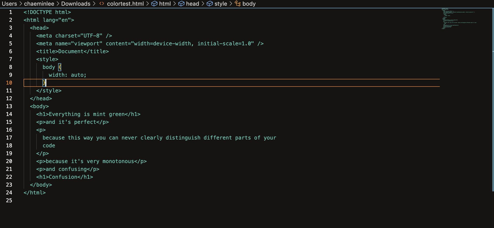

# Confusemint

I am trying to code an AI coding agent as a VS code extension without using ***any*** help from AI. Just stack overflow, official documentations, and Google's websites.

In the process, I've learned about yeoman and yo, and that I can make my own VS code color theme.

So here's the world's most syntactically monotonous color theme as a way for me to familiarize myself with yo a bit, although looking back I don't think this did much for my learning.

